# OOAD 实验 3 -- 弹球游戏

本仓库是<https://github.com/Discreater/gizmoBall>的网页版。

需要先安装Node.js以及npm

## 安装依赖库

```sh
npm install
```

### 本地开发模式

```sh
npm run serve
localhost:8080
```

### 打包构建

```sh
npm run build
```


## 实验样图：

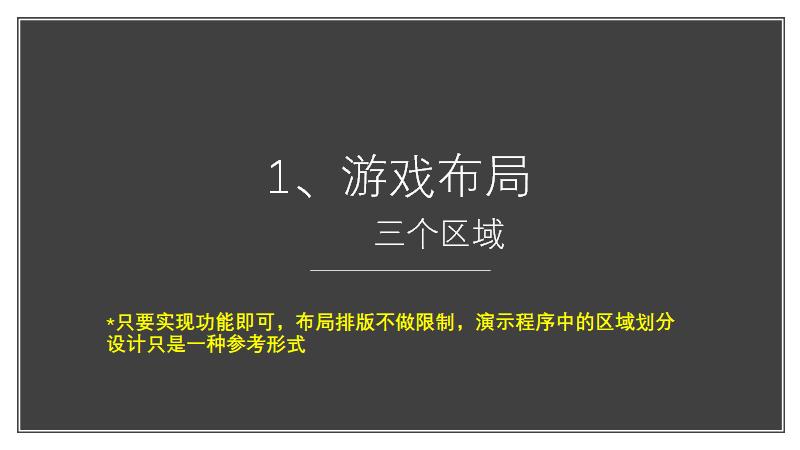

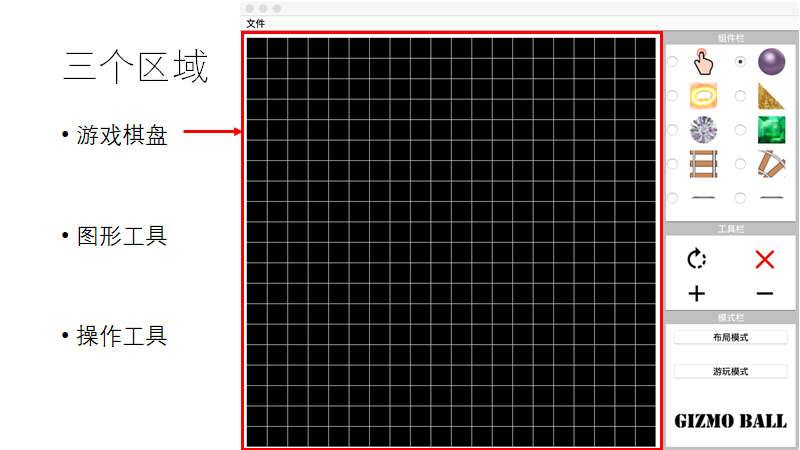

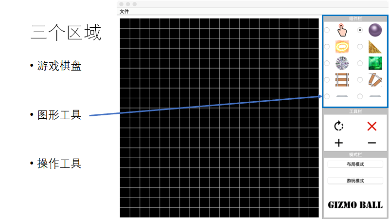

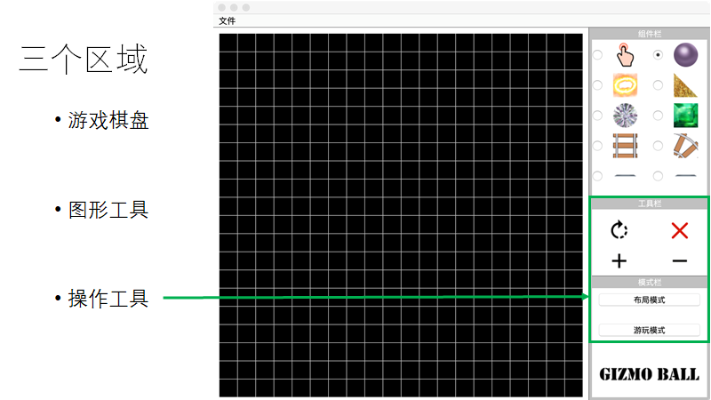

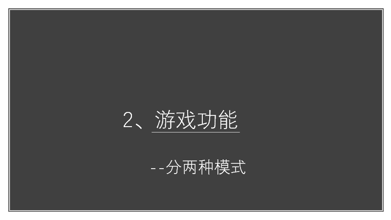

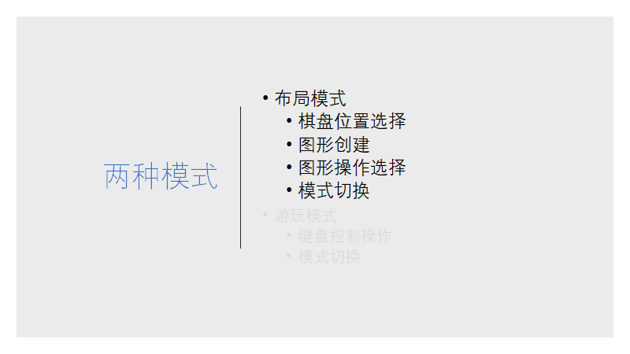

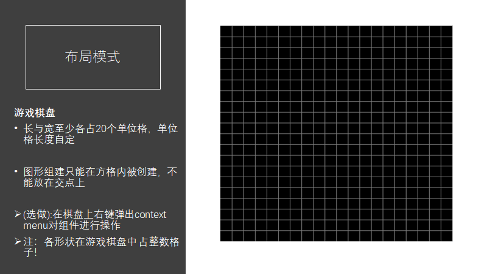

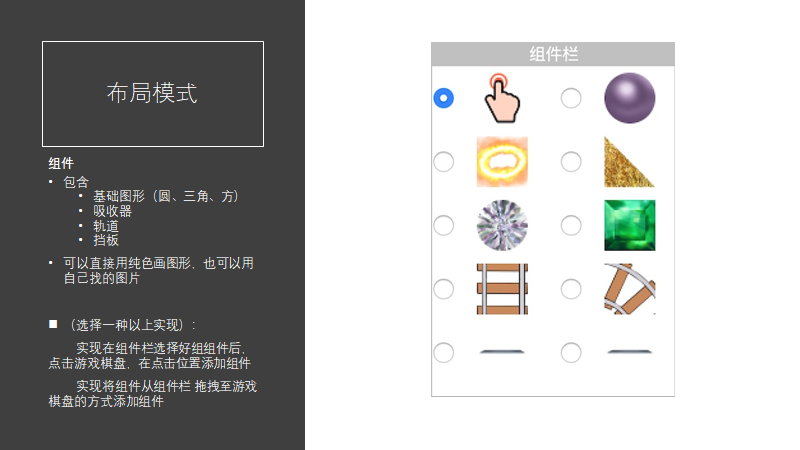

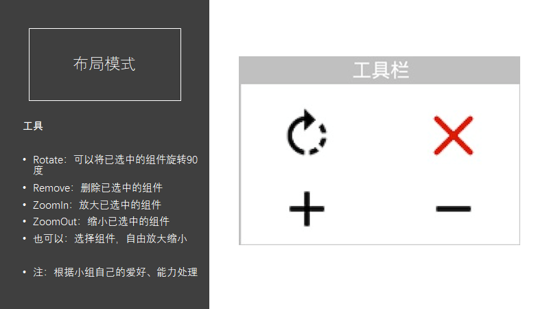

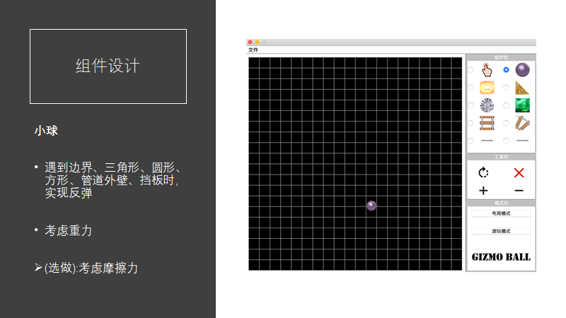

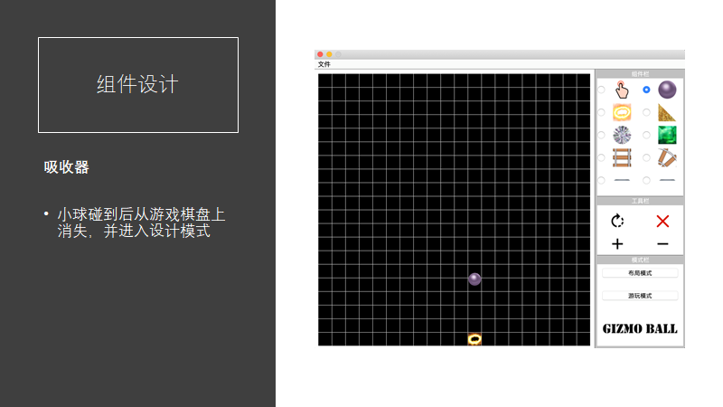

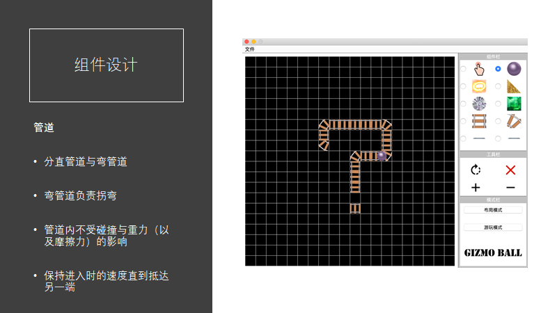

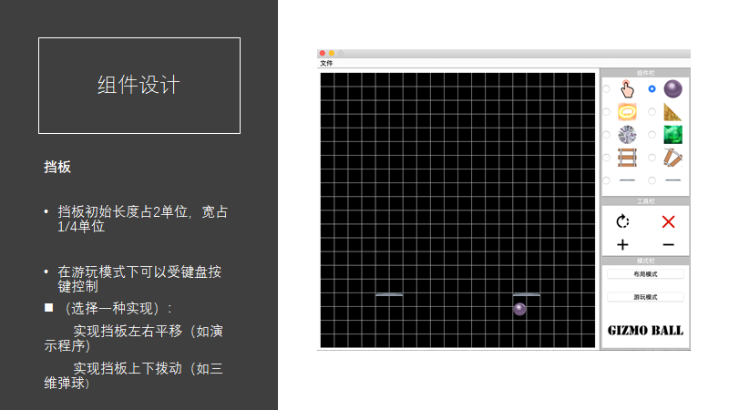

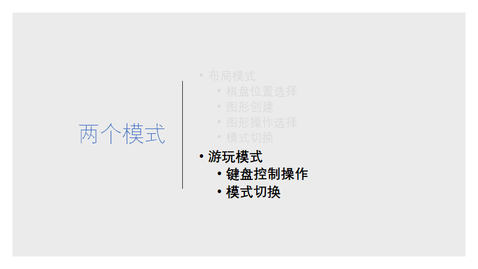

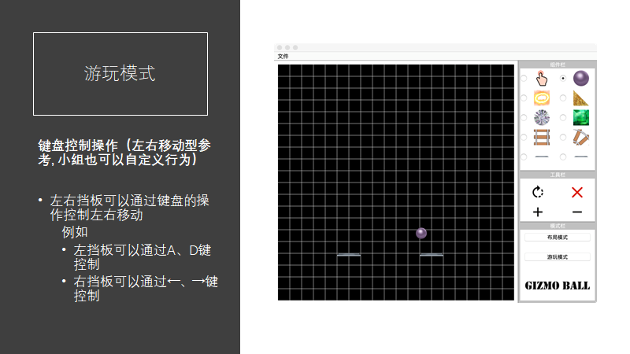

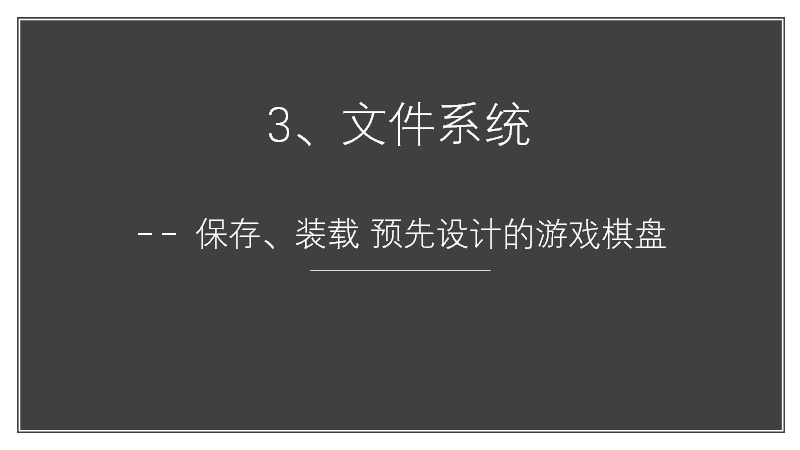

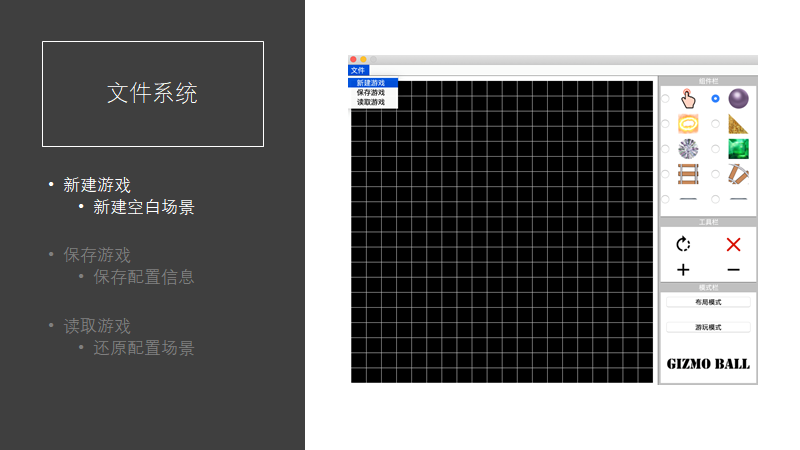

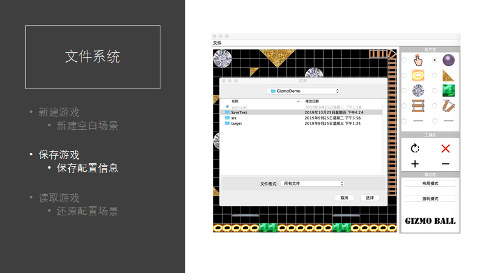


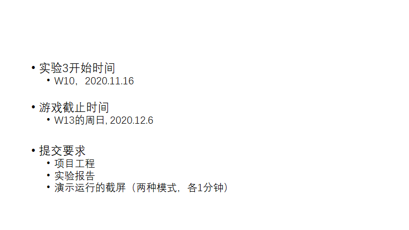